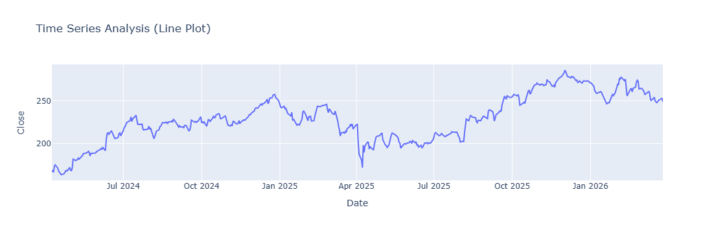
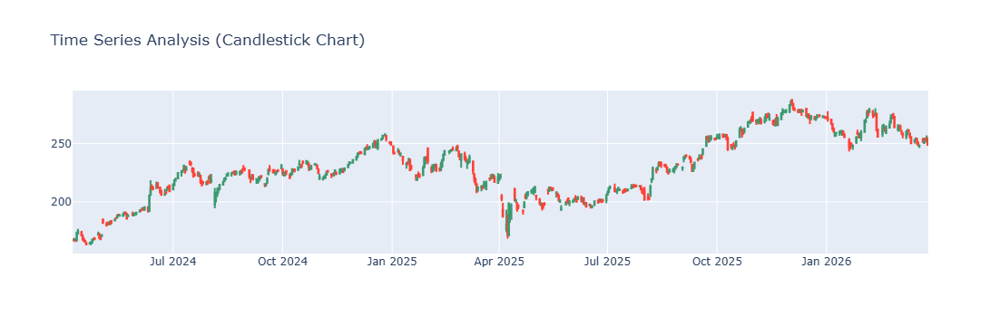
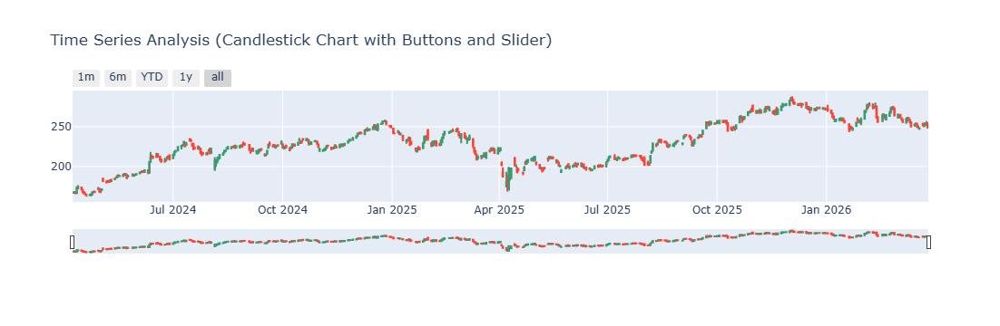
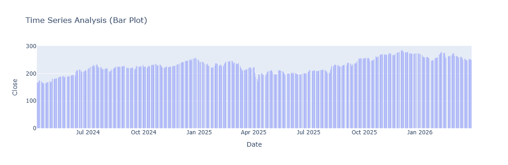
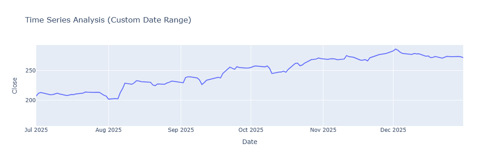

Here's a clean README for your time series analysis project:

---

# 📈 Time Series Analysis – AAPL Stock Price Visualization

## Overview

This project performs time series analysis on Apple Inc. (AAPL) stock price data using Python. It demonstrates multiple visualization techniques — from simple line plots to interactive candlestick charts with range selectors — using real-time data fetched via the `yfinance` API.

---

## 📁 Project Structure

```
├── Time-series_analysis.ipynb   # Main Jupyter Notebook
├── bar_plot.png                 # Bar chart output
├── candlestick.png              # Static candlestick chart
├── candlestick_interactive.png  # Interactive candlestick with range buttons
├── Custom_date_range.png        # Line plot for custom date range
├── Line_plot.png                # Full period line plot
└── README.md
```

---

## 🛠️ Libraries & Dependencies

| Library | Purpose |
|---|---|
| `yfinance` | Fetching historical stock data |
| `pandas` | Data manipulation |
| `plotly.express` | Line and bar chart visualizations |
| `plotly.graph_objects` | Candlestick chart construction |
| `datetime` | Dynamic date range calculation |

Install dependencies:
```bash
pip install yfinance plotly pandas
```

---

## 📊 Data Source

- **Ticker:** AAPL (Apple Inc.)
- **Period:** Last 720 days from today (dynamically calculated)
- **Columns used:** `Open`, `High`, `Low`, `Close`, `Volume`

Sample data snapshot:

| Date | Close | High | Low | Open | Volume |
|---|---|---|---|---|---|
| 2024-04-08 | 166.93 | 167.67 | 166.72 | 167.51 | 37,425,500 |
| 2024-04-09 | 168.14 | 168.55 | 166.83 | 167.18 | 42,373,800 |

---

## 📉 Visualizations

### 1. Line Plot
A full-period line chart showing AAPL's daily closing price from April 2024 to March 2026. Useful for spotting overall trend direction at a glance.

> Built with `plotly.express.line()`



---

### 2. Candlestick Chart
Displays Open, High, Low, and Close prices for each trading day. Green candles indicate price gains; red candles indicate losses. Clearly shows the sharp correction in early April 2025 and the subsequent recovery.

> Built with `plotly.graph_objects.Candlestick()`



---

### 3. Interactive Candlestick with Range Selector
Extends the candlestick chart with:
- **Quick-select buttons:** 1m, 6m, YTD, 1y, All
- **Range slider** at the bottom for granular navigation

> Built with `figure.update_xaxes(rangeslider_visible=True, rangeselector=...)`



---

### 4. Bar Plot
Each trading day rendered as a vertical bar, coloured by the Plotly default palette. Effective for comparing relative price levels across the full two-year window.

> Built with `plotly.express.bar()`



---

### 5. Custom Date Range – Line Plot
Zooms into a specific period (July 2025 – December 2025) using `range_x`. Highlights the steady upward trend AAPL followed in the second half of 2025, peaking near $280 in December.

> Built with `plotly.express.line(range_x=[...])`



---

## 🔑 Key Observations

- AAPL traded between **~$165 and ~$290** over the two-year window
- A significant **drawdown in April 2025** (~$185 low) followed by a strong recovery
- The stock reached its **peak (~$285)** around December 2025 / January 2026
- Overall trend across the period is **bullish**, with volatility clusters visible around earnings periods

---

## ▶️ How to Run

```bash
# Clone the repository
git clone <your-repo-url>

# Launch the notebook
jupyter notebook Time-series_analysis.ipynb
```

> The notebook dynamically sets the date range relative to today, so charts will update automatically each time it is run.

---

## 🙋 Author

**Jayesh Amudan**
MSc Business Analysis & Consulting | Data Analyst
[LinkedIn](#) · [GitHub](#)
